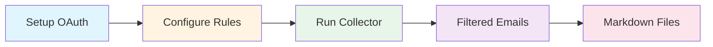
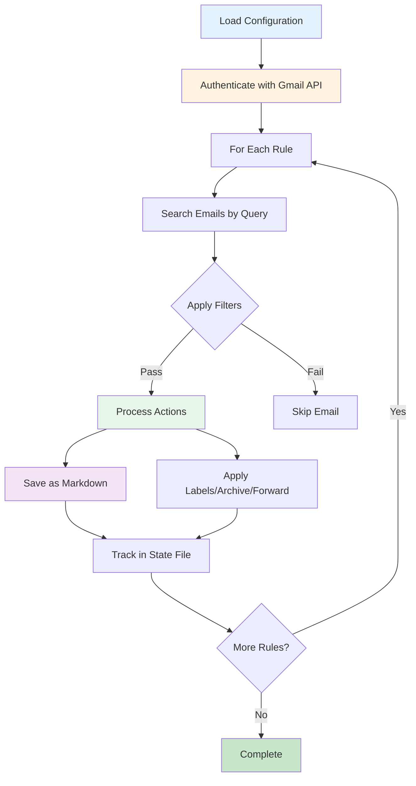
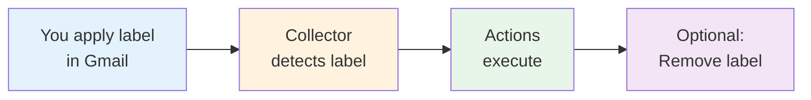

# Gmail Collector

**Automated email collection and processing from Gmail using rule-based filtering and secure OAuth authentication.**

The Gmail collector retrieves, filters, and processes emails from your Gmail account based on configurable rules. It supports advanced filtering, automatic actions (labeling, archiving, forwarding), and generates organized markdown output for downstream analysis or archival.

---

## Table of Contents

- [Quick Start](#quick-start)
- [How It Works](#how-it-works)
- [Authentication Setup](#authentication-setup)
- [Configuration](#configuration)
- [Usage](#usage)
- [Email Sending](#email-sending)
- [Output Structure](#output-structure)
- [Security & Privacy](#security--privacy)
- [Troubleshooting](#troubleshooting)

---

## Quick Start



### Minimal Setup

1. **Set up Google Cloud credentials** (see [Authentication Setup](#authentication-setup))
2. **Configure your rules** in `settings/gmail.yaml`
3. **Authenticate once**: `uv run signal-gmail --config settings/gmail.yaml --auth-only`
4. **Collect emails**: `uv run signal-gmail --config settings/gmail.yaml`

**Working Directory:** Always run commands from the `/signal` directory, not from subdirectories.

---

## How It Works

The Gmail collector processes emails through this workflow:



### Key Concepts

- **Rules**: Each rule defines a Gmail search query, filtering criteria, and actions to perform
- **State Management**: Tracks processed emails to prevent duplicate processing
- **Atomic Actions**: Each email can have multiple actions (save, label, archive, forward) tracked independently
- **Filters**: Content-based filtering applies after Gmail query matching for fine-grained control

---

## Authentication Setup

Gmail collector uses OAuth 2.0 for secure, token-based authentication. You'll need to set this up once.

### Step 1: Create Google Cloud Project

1. Go to [Google Cloud Console](https://console.cloud.google.com/)
2. Create a new project (or select existing)
3. Note your Project ID

### Step 2: Enable Gmail API

**Via Console:**
- Navigate to **APIs & Services** → **Library**
- Search for "Gmail API"
- Click **Enable**

**Via CLI (optional):**
```bash
gcloud services enable gmail.googleapis.com --project=YOUR_PROJECT_ID
```

### Step 3: Create OAuth Credentials

1. Go to **APIs & Services** → **Credentials**
2. Click **Create Credentials** → **OAuth 2.0 Client IDs**
3. Choose **Desktop Application** as application type
4. Download the credentials JSON file
5. Save it to `./data/gmail_credentials.json`

### Step 4: Set Environment Variables

```bash
# Required: Path to credentials file
export GMAIL_CREDENTIALS="./data/gmail_credentials.json"

# Optional: Custom token storage location
export GMAIL_TOKEN="./data/gmail_token.json"
```

### Step 5: Authenticate

Run the authentication-only command to complete OAuth flow:

```bash
uv run signal-gmail --config settings/gmail.yaml --auth-only
```

This will:
1. Open your browser for Google OAuth consent
2. Request necessary Gmail permissions
3. Save the access token to `GMAIL_TOKEN` path
4. Verify API connectivity

**Token Refresh:** Tokens are automatically refreshed when they expire. If issues arise, simply re-run the `--auth-only` command.

---

## Configuration

Configuration uses YAML format with environment variable substitution support.

### Basic Structure

```yaml
# Output directory for saved emails
output_dir: "./output/gmail"

# OAuth token and credentials paths
token_file: "./data/gmail_token.json"
credentials_file: "./data/gmail_credentials.json"

# API rate limiting (seconds between requests)
rate_limit_seconds: 1.0

# Gmail API batch size
batch_size: 50

# OAuth scopes (permissions)
scopes:
  - "https://www.googleapis.com/auth/gmail.readonly"    # Read emails
  - "https://www.googleapis.com/auth/gmail.modify"      # Archive/mark read
  - "https://www.googleapis.com/auth/gmail.labels"      # Add/remove labels
  - "https://www.googleapis.com/auth/gmail.send"        # Send/forward emails

# Email processing rules
rules:
  - name: "Important Notifications"
    query: "from:noreply@service.com subject:alert"
    actions: ["save", "label:processed", "archive"]
    max_messages: 100
    save_attachments: true
    filters:
      max_age_days: 7
      include_keywords: ["urgent", "critical"]
```

### Rule Configuration

Each rule defines what emails to collect and what to do with them:

| Field | Type | Required | Description |
|-------|------|----------|-------------|
| `name` | string | Yes | Descriptive name for the rule (used in output organization) |
| `query` | string | Yes | Gmail search query (uses Gmail search syntax) |
| `actions` | list | No | Actions to apply: `save`, `archive`, `mark_read`, `label:name`, `forward:email` |
| `max_messages` | integer | No | Maximum emails to process per run (default: 100) |
| `save_attachments` | boolean | No | Whether to download attachments (default: true) |
| `filters` | object | No | Additional content filters (see below) |

### Filter Criteria

Filters provide additional content-based filtering after Gmail query matching:

```yaml
filters:
  max_age_days: 30                    # Only process emails newer than 30 days
  include_keywords:                   # Must contain at least one keyword
    - "design"
    - "ai"
    - "research"
  exclude_keywords:                   # Skip if contains any keyword
    - "limited time"
    - "50% off"
    - "urgent"
```

### Cascading Keywords (Two-Level Filtering)

Keywords cascade from two levels and **UNION together** (all keywords from all levels apply):

**Level 1: Global Keywords** (`default_filters` in `gmail.yaml`)
- Applies to ALL rules in this Gmail configuration
- Tool-wide keywords

**Level 2: Rule Keywords** (individual rule `filters`)
- Applies to specific Gmail rule
- Most specific keywords

**Example:**

```yaml
# gmail.yaml
default_filters:
  include_keywords: ["urgent", "report", "AI"]
  exclude_keywords: ["promotional", "spam"]

rules:
  - name: "design-updates"
    query: "from:designer@example.com"
    filters:
      include_keywords: ["mockup", "prototype"]
      exclude_keywords: ["draft"]
```

**Result:** Email must contain at least one of:
- `["urgent", "report", "AI", "mockup", "prototype"]`

And must NOT contain any of:
- `["promotional", "spam", "draft"]`

**Note:** Keywords support wildcards (`claude*` matches `claude`, `claude-code`, etc.)

### Gmail Search Query Examples

The `query` field uses [Gmail's search syntax](https://support.google.com/mail/answer/7190):

```yaml
# By sender
query: "from:newsletter@example.com"

# By subject
query: "subject:(report OR update)"

# By date range
query: "after:2024/01/01 before:2024/12/31"

# With labels
query: "label:important -label:processed"

# Multiple criteria
query: "from:noreply@service.com subject:alert is:unread newer_than:7d"

# Has attachments
query: "has:attachment filename:pdf"
```

### Available Actions

| Action | Description | Required Scope |
|--------|-------------|----------------|
| `save` | Save email as markdown file | `gmail.readonly` |
| `archive` | Remove from inbox (move to All Mail) | `gmail.modify` |
| `mark_read` | Mark as read | `gmail.modify` |
| `label:name` | Add label (creates if doesn't exist) | `gmail.labels` |
| `remove_label:name` | Remove label | `gmail.labels` |
| `forward:email@domain.com` | Forward to recipient | `gmail.send` |
| `delete` | Move to trash (recoverable for 30 days) | `gmail.modify` |
| `delete_permanent` | Permanently delete (irreversible) | `gmail.modify` |

### Example Configuration

See the complete example at `/Users/williamtrekell/Documents/signal/signal/settings/gmail.yaml`:

```yaml
rules:
  - name: "design-information"
    query: "from:noreply@medium.com OR from:designwithai@substack.com"
    actions: ["save", "archive", "label:notebooklm"]
    max_messages: 20
    save_attachments: false
    filters:
      max_age_days: 20

  - name: "using-ai"
    query: "from:aiadopters@substack.com"
    actions: ["save", "forward:wtread@library.readwise.io", "archive"]
    max_messages: 20
    filters:
      max_age_days: 20
      exclude_keywords: ["limited time", "50% off", "urgent"]
```

### Label-Based Trigger Rules (NEW)

**Label rules** enable manual control over email processing by watching for Gmail labels you apply. When the collector detects a trigger label, it automatically performs the configured actions.

#### How It Works



#### Configuration

```yaml
label_rules:
  - name: "Manual Archive Queue"
    trigger_label: "to-archive"          # Label to watch for
    actions: ["save", "archive"]         # Actions to perform
    remove_trigger: true                 # Remove label after processing
    max_messages: 50
    save_attachments: true
    filters:                             # Optional content filtering
      exclude_keywords: ["promotional"]
```

#### Label Rule Fields

| Field | Type | Required | Description |
|-------|------|----------|-------------|
| `name` | string | Yes | Descriptive name for this label rule |
| `trigger_label` | string | Yes | Gmail label to monitor (e.g., "to-archive") |
| `actions` | list | Yes | Actions to perform (same as query rules) |
| `remove_trigger` | boolean | No | Remove trigger label after processing (default: true) |
| `max_messages` | integer | No | Max messages to process per run (default: 50) |
| `save_attachments` | boolean | No | Download attachments (default: true) |
| `filters` | object | No | Content filtering criteria |

#### Example Use Cases

**1. Manual Archive Queue**
```yaml
- name: "Archive Queue"
  trigger_label: "to-archive"
  actions: ["save", "archive"]
  remove_trigger: true
```
*Workflow: Apply "to-archive" label to any email → Collector saves and archives it → Label removed*

**2. Forward to Assistant**
```yaml
- name: "Assistant Forward"
  trigger_label: "for-assistant"
  actions: ["forward:assistant@example.com", "label:forwarded"]
  remove_trigger: true
```
*Workflow: Label email with "for-assistant" → Collector forwards it → Adds "forwarded" label → Removes trigger*

**3. Important Backup**
```yaml
- name: "Important Archive"
  trigger_label: "archive-important"
  actions: ["save", "label:archived", "label:backup"]
  remove_trigger: true
  filters:
    exclude_keywords: ["promotional"]
```
*Workflow: Label critical emails → Collector backs up and labels → Trigger removed*

**4. Processing Queue (Keep Label)**
```yaml
- name: "Processing Queue"
  trigger_label: "in-queue"
  actions: ["save", "label:processed"]
  remove_trigger: false  # Keep label for manual tracking
```
*Workflow: Emails stay in queue → Collector processes but keeps label → Manual removal*

#### Nested Labels

Gmail supports nested labels using `/` for folder-like organization:

```yaml
- name: "Action Archive"
  trigger_label: "actions/archive"    # Nested under "actions" folder
  actions: ["save", "archive", "label:actions/completed"]
  remove_trigger: true
```

#### Label Rules vs Query Rules

| Feature | Query Rules | Label Rules |
|---------|-------------|-------------|
| **Triggering** | Automatic (Gmail search) | Manual (apply label) |
| **Control** | Configuration-based | User-initiated |
| **Processing** | Batch/scheduled | On-demand |
| **State Tracking** | By message ID | By label rule + message ID |
| **Independence** | Can process same email as label rules | Can process same email as query rules |

**Key Point:** The same email can be processed by both a query rule AND a label rule independently because they use different state tracking keys:
- Query rule: `{message_id}`
- Label rule: `label_rule:{rule_name}:{message_id}`

#### Best Practices

1. **Start with `remove_trigger: true`** - Prevents label clutter in Gmail
2. **Use descriptive label names** - `to-archive` not `ta`
3. **Test with small `max_messages`** - Start with 5-10 before increasing
4. **Add filters for safety** - Use `exclude_keywords` to prevent accidents
5. **Always backup before delete** - Include "save" action before "delete"
6. **Use nested labels for organization** - `actions/archive`, `actions/forward`

#### Label Naming Rules

- **Allowed characters:** Letters, numbers, dash `-`, underscore `_`, slash `/`
- **Nesting:** Use `/` to create folder structure (e.g., `parent/child`)
- **Case-insensitive:** Normalized to lowercase automatically
- **Examples:** `to-archive`, `process-later`, `actions/forward`

#### State Management

Label rules track processing separately from query rules:
- State prevents re-processing even if `remove_trigger: false`
- Each label rule maintains its own processing history
- Same email can be processed by multiple label rules
- State file: `.gmail_state.json` in output directory

#### Complete Example

See `settings/gmail-example.yaml` for a comprehensive configuration with 6 label rule examples covering common workflows.

---

## Usage

### Basic Collection

Collect emails using all configured rules:

```bash
uv run signal-gmail --config settings/gmail.yaml
```

### Single Rule Collection

Process only a specific rule:

```bash
uv run signal-gmail --config settings/gmail.yaml --rule "Important Notifications"
```

### Validation & Testing

Test configuration without processing emails:

```bash
uv run signal-gmail --config settings/gmail.yaml --dry-run
```

Test specific rule:

```bash
uv run signal-gmail --config settings/gmail.yaml --rule "design-information" --dry-run
```

### Debug Mode

Enable verbose logging for troubleshooting:

```bash
uv run signal-gmail --config settings/gmail.yaml --verbose
```

### Command Options

| Option | Short | Description |
|--------|-------|-------------|
| `--config PATH` | `-c` | Path to YAML configuration file (required) |
| `--rule TEXT` | `-r` | Process only the specified rule |
| `--dry-run` | | Validate configuration without processing emails |
| `--verbose` | `-v` | Enable detailed logging output |
| `--auth-only` | | Perform authentication setup only |

### Collection Output

The collector displays statistics after each run:

```
Collection completed:
  Rules processed: 3
  Total messages saved: 15
  Actions for 'design-information': 3
  Actions for 'using-ai': 8
  Actions for 'snippets-and-lists': 4
  Total messages skipped: 5
  Total messages processed: 20
```

---

## Email Sending

The Gmail collector includes a separate command for sending emails.

### Basic Email

```bash
uv run signal-gmail-send \
  --to "recipient@example.com" \
  --subject "Project Update" \
  --body "Here is the latest status update..."
```

### Email with CC/BCC

```bash
uv run signal-gmail-send \
  --to "primary@example.com" \
  --cc "team@example.com" \
  --bcc "archive@example.com" \
  --subject "Team Meeting Notes" \
  --body "Meeting summary attached"
```

### Email from File

```bash
uv run signal-gmail-send \
  --to "recipient@example.com" \
  --subject "Report" \
  --body-file "./report.txt"
```

### Forward Existing Email

```bash
uv run signal-gmail-send \
  --forward "MESSAGE_ID_HERE" \
  --to "colleague@example.com" \
  --additional-body "FYI - this might interest you:"
```

### Sending Options

| Option | Description |
|--------|-------------|
| `--to EMAIL` | Recipient email address (required) |
| `--subject TEXT` | Email subject line (required for new emails) |
| `--body TEXT` | Email body content |
| `--body-file PATH` | Read body from file |
| `--from EMAIL` | Sender address (defaults to authenticated account) |
| `--cc EMAIL` | CC recipients (comma-separated) |
| `--bcc EMAIL` | BCC recipients (comma-separated) |
| `--reply-to EMAIL` | Reply-to address |
| `--forward MSG_ID` | Forward existing message by ID |
| `--additional-body TEXT` | Text to add before forwarded content |
| `--dry-run` | Show what would be sent without sending |
| `--verbose` | Enable detailed output |

---

## Output Structure

### Directory Organization

Emails are organized by rule name and collection date:

```
output/gmail/
├── Important_Notifications/
│   └── 2024-01-15/
│       ├── 2024-01-15_critical_alert_abc123.md
│       └── 2024-01-15_service_update_def456.md
├── design-information/
│   └── 2024-01-15/
│       └── 2024-01-15_weekly_design_newsletter_ghi789.md
└── attachments/
    └── abc123/
        ├── report.pdf
        └── data.csv
```

### Markdown File Format

Each email is saved as a markdown file with structured frontmatter:

```markdown
---
title: "Critical System Alert - Immediate Action Required"
from: "noreply@important-service.com"
to: "admin@company.com"
date: "2024-01-15T08:30:00Z"
source: "gmail"
rule: "Important Notifications"
message_id: "abc123"
thread_id: "thread_abc123"
size_estimate: 15234
---

## Email Details

**From:** noreply@important-service.com
**To:** admin@company.com
**Date:** 2024-01-15T08:30:00Z
**Subject:** Critical System Alert - Immediate Action Required

## Snippet

System alert: Database connection lost. Immediate action required.

## Message Body

We have detected a database connection issue that requires immediate attention...
```

### Filename Convention

Files are named using the pattern:
```
{date}_{subject}_{message_id}.md
```

- **date**: Email received date (YYYY-MM-DD)
- **subject**: Sanitized subject line (alphanumeric, limited to 50 chars)
- **message_id**: Gmail message ID for uniqueness

### Attachment Handling

When `save_attachments: true`, attachments are saved to:
```
{output_dir}/attachments/{message_id}/{filename}
```

---

## Security & Privacy

### OAuth Security

- **Minimal Scopes**: Requests only necessary permissions
- **Token Protection**: Secure token storage with automatic refresh
- **Credential Isolation**: Environment variable-based credential management
- **No Password Storage**: OAuth tokens eliminate password exposure

### Recommended Scopes

For **read-only collection** (no actions):
```yaml
scopes:
  - "https://www.googleapis.com/auth/gmail.readonly"
```

For **full functionality** (all actions):
```yaml
scopes:
  - "https://www.googleapis.com/auth/gmail.readonly"
  - "https://www.googleapis.com/auth/gmail.modify"
  - "https://www.googleapis.com/auth/gmail.labels"
  - "https://www.googleapis.com/auth/gmail.send"
```

### Input Validation

All configuration and CLI inputs are validated to prevent:
- **Email injection attacks**: RFC-compliant email validation
- **Path traversal**: Secure file path handling
- **Query injection**: Gmail query syntax validation
- **Script injection**: Content sanitization

### Privacy Controls

The collector includes built-in privacy protections:
- **Content Sanitization**: All email content is sanitized before storage
- **Secure State Management**: Atomic file operations prevent corruption
- **Audit Trails**: Complete logging of all email access operations
- **No Credential Logging**: Sensitive data never appears in logs

### Rate Limiting

Gmail API quotas are managed through:
- Configurable delays between requests (`rate_limit_seconds`)
- Exponential backoff for transient errors
- Automatic retry with jitter for rate limit responses

**Daily Quotas:**
- Free tier: 1,000,000,000 quota units/day
- Each message fetch: ~5-10 quota units
- Batch operations use fewer quota units per message

---

## Troubleshooting

### Authentication Issues

**"Credentials not found" errors:**
```bash
# Verify environment variables
echo $GMAIL_TOKEN
echo $GMAIL_CREDENTIALS

# Re-run authentication
uv run signal-gmail --config settings/gmail.yaml --auth-only --verbose
```

**"Insufficient permissions" errors:**
- Check OAuth scopes in Google Cloud Console
- Verify token has required permissions
- May need to regenerate token with broader scopes

**Token expiration:**
```bash
# Tokens auto-refresh, but if issues persist:
rm $GMAIL_TOKEN
uv run signal-gmail --config settings/gmail.yaml --auth-only
```

### API Quota Issues

**"Quota exceeded" errors:**
1. Check quota usage in [Google Cloud Console](https://console.cloud.google.com/apis/api/gmail.googleapis.com/quotas)
2. Reduce `batch_size` in configuration
3. Increase `rate_limit_seconds` to space out requests
4. Reduce `max_messages` per rule

Example quota-friendly configuration:
```yaml
batch_size: 25              # Smaller batches
rate_limit_seconds: 2.0     # More delay between requests
```

### Email Processing Issues

**"No emails found" with valid query:**
1. Test query in Gmail web interface search
2. Check date ranges and label names match exactly
3. Use `--verbose` for query debugging:
   ```bash
   uv run signal-gmail --config settings/gmail.yaml --rule "rule-name" --verbose
   ```

**Emails skipped unexpectedly:**
- Check filter criteria (`max_age_days`, keywords)
- Verify state file hasn't marked them as processed
- Use `--dry-run --verbose` to see filtering decisions

**Attachment download failures:**
```bash
# Check permissions and disk space
ls -la ./output/gmail/attachments/
df -h

# Verify attachment directory in config
attachment_dir: "./output/gmail/attachments"  # Must be writable
```

### Configuration Validation

**Query syntax errors:**
- Gmail queries must use valid operators: `from:`, `to:`, `subject:`, `label:`, etc.
- Email addresses must be used with operators: `from:user@domain.com`, not bare `user@domain.com`
- Refer to [Gmail search operators](https://support.google.com/mail/answer/7190)

**Action validation errors:**
Valid action formats:
- Simple: `save`, `archive`, `mark_read`, `delete`
- With parameter: `label:name`, `remove_label:name`, `forward:email@domain.com`

### Debug Commands

**Test authentication only:**
```bash
uv run signal-gmail --config settings/gmail.yaml --auth-only --verbose
```

**Test specific rule without processing:**
```bash
uv run signal-gmail --config settings/gmail.yaml --rule "rule-name" --dry-run --verbose
```

**Check Gmail API connectivity:**
```bash
uv run signal-gmail --config settings/gmail.yaml --dry-run --verbose
```

### Common Errors Reference

| Error | Cause | Solution |
|-------|-------|----------|
| `FileNotFoundError: credentials` | Missing credentials file | Check `GMAIL_CREDENTIALS` path |
| `AuthenticationFailureError` | OAuth token invalid/expired | Run `--auth-only` to re-authenticate |
| `ConfigurationValidationError` | Invalid YAML syntax | Validate YAML structure, check indentation |
| `NetworkConnectionError` | API timeout/unavailable | Check internet connection, retry with backoff |
| `StateManagementError` | Corrupted state file | Delete state file and re-run collection |

### Performance Optimization

For large mailboxes:
1. Use specific queries to narrow search scope
2. Limit `max_messages` per rule
3. Increase `rate_limit_seconds` to avoid quota issues
4. Process rules one at a time using `--rule` option
5. Use filters to reduce processing overhead

---

## Additional Resources

- **Gmail Search Syntax**: https://support.google.com/mail/answer/7190
- **Gmail API Documentation**: https://developers.google.com/gmail/api
- **OAuth 2.0 Scopes**: https://developers.google.com/gmail/api/auth/scopes
- **Google Cloud Console**: https://console.cloud.google.com/

**Project Location**: `/Users/williamtrekell/Documents/signal/signal/src/collectors/gmail/`

**Configuration Example**: `/Users/williamtrekell/Documents/signal/signal/settings/gmail.yaml`
