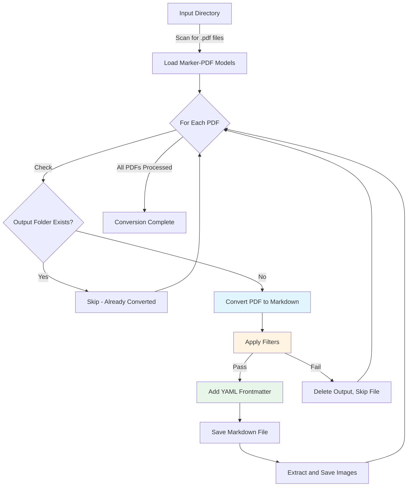

# PDF to Markdown Converter

A standalone batch processing tool that converts PDF documents into clean, searchable Markdown files with structured metadata. Built on the marker-pdf library for high-quality document conversion with OCR support.

## Quick Start

**1. Install dependencies** (first time only):
```bash
cd /Users/williamtrekell/Documents/durandal/tools/pdf-to-md
uv sync
```

**2. Place PDF files** in the input directory:
```bash
/Users/williamtrekell/Documents/durandal/input/pdf-to-md/
```

**3. Run the conversion**:
```bash
cd /Users/williamtrekell/Documents/durandal/tools/pdf-to-md
uv run python pdf_to_md.py
```

**4. Find converted files** organized by PDF name:
```bash
/Users/williamtrekell/Documents/durandal/output/pdf-to-md/{pdf-name}/{pdf-name}.md
/Users/williamtrekell/Documents/durandal/output/pdf-to-md/{pdf-name}/[extracted-images].png
```

## Table of Contents

- [What This Tool Does](#what-this-tool-does)
- [How It Works](#how-it-works)
- [Configuration](#configuration)
  - [Basic Conversion Settings](#basic-conversion-settings)
  - [Content Filtering](#content-filtering)
  - [OCR and Language Settings](#ocr-and-language-settings)
  - [Image Extraction](#image-extraction)
- [Output Structure](#output-structure)
- [Common Use Cases](#common-use-cases)
- [Processing Time and Expectations](#processing-time-and-expectations)
- [Troubleshooting](#troubleshooting)

## What This Tool Does

The PDF-to-Markdown converter processes all PDF files in a designated input folder and produces:

- **Markdown files** with preserved document structure (headings, lists, tables, bold/italic text)
- **Extracted images** saved as PNG files alongside the markdown
- **YAML frontmatter** with standardized metadata for each document
- **Optional content filtering** to selectively convert PDFs based on age or keywords

**Key Features:**
- Batch processing of multiple PDFs in one run
- High-quality text extraction using AI-powered recognition
- OCR support for scanned documents and image-based PDFs
- Configurable filtering applied *after* conversion (choose which PDFs to keep)
- Debug output for troubleshooting conversion issues

## How It Works



**Processing Flow:**
1. **Scan** - Tool finds all `.pdf` files in input directory
2. **Check** - Skips PDFs with existing output folders (prevents duplicate work)
3. **Convert** - Marker-pdf library extracts text, structure, and images
4. **Filter** - Optional filters evaluate content (age, keywords) to determine if PDF should be kept
5. **Metadata** - Adds YAML frontmatter with title, dates, page count
6. **Save** - Writes markdown file and image assets to organized output folder

**Important:** Filters are applied *after* conversion, not before. The tool converts each PDF, then decides whether to keep or discard the result based on the converted content.

## Configuration

All settings are managed in `/Users/williamtrekell/Documents/durandal/settings/pdf-to-md.yaml`. You can also specify a custom configuration file:

```bash
uv run python pdf_to_md.py --config /path/to/custom-config.yaml
```

### Basic Conversion Settings

#### Output Directory
```yaml
output_dir: "output/pdf-to-md"
```
Where to save converted files (relative to project root). Each PDF gets its own subfolder.

#### Page Range Control
```yaml
max_pages: null        # Process all pages (or set to number, e.g., 10 for first 10 pages)
start_page: null       # Start from page 1 (or set to number to skip initial pages)
```
**Use cases:**
- Test conversion on first 5 pages: `max_pages: 5`
- Skip cover page: `start_page: 2`
- Extract specific section: `start_page: 10, max_pages: 5` (pages 10-14)

#### Language Detection
```yaml
langs: null            # Auto-detect (or specify: ["en", "es", "fr"])
default_lang: English  # Fallback if auto-detection fails
```
**Common language codes:** en (English), es (Spanish), fr (French), de (German), zh (Chinese), ja (Japanese)

#### Processing Performance
```yaml
batch_multiplier: 1    # Higher = faster but uses more memory (try 2-4 if you have 16GB+ RAM)
torch_device: null     # Auto-detect best hardware (cpu, cuda, or mps for Mac)
```

### Content Filtering

Filters are applied **after** PDF conversion to determine which converted files to keep. This allows the tool to evaluate the actual extracted content.

```yaml
filters:
  max_age_days: null             # Only keep PDFs modified within last N days
  include_keywords: []           # Only keep PDFs containing at least one keyword
  exclude_keywords: []           # Skip PDFs containing any of these keywords
```

**Keyword Matching Features:**
- **Case-insensitive** - "report" matches "Report", "REPORT", "RePoRt"
- **Wildcards supported:**
  - `*` matches multiple characters: "analy*" matches "analysis", "analytics", "analytical"
  - `?` matches single character: "repo?t" matches "report", "repost"
- **Searches all content** - matches against PDF filename and converted markdown text

**Example: Keep only recent AI research papers**
```yaml
filters:
  max_age_days: 90                    # Only PDFs from last 3 months
  include_keywords:
    - "artificial intelligence"
    - "machine learning"
    - "neural network*"
  exclude_keywords:
    - "draft"
    - "preliminary"
    - "*wip*"                         # Work in progress
```

**Example: Archive financial reports, exclude forecasts**
```yaml
filters:
  max_age_days: 365                   # Only PDFs from current year
  include_keywords:
    - "financial report"
    - "earnings statement"
    - "balance sheet"
  exclude_keywords:
    - "forecast"
    - "projection"
    - "estimate*"
```

**When filters reject a PDF:**
- The tool logs "Filtered out {filename}"
- The output folder is deleted (no disk space wasted)
- Processing continues with the next PDF

### OCR and Language Settings

OCR (Optical Character Recognition) converts images of text into actual selectable text. This is essential for scanned documents.

```yaml
ocr_all_pages: false              # Force OCR on every page (slower but more thorough)
ocr_all_pages_global: false       # Alternative global setting for same feature
ocr_engine: surya                 # OCR engine: "surya" (recommended) or "ocrmypdf"
```

**When to enable OCR:**
- Your PDFs are scanned documents (photos/scans of printed pages)
- Text appears blurry or isn't selectable in original PDF
- Conversion produces garbled or missing text

**OCR Performance Impact:**
- Text-based PDFs: Fast (seconds per page)
- Scanned PDFs with OCR: Slower (5-30 seconds per page depending on quality)

**Choosing an OCR Engine:**
- **surya** (default): Fast, accurate, good for most documents
- **ocrmypdf**: Alternative engine, try if surya produces poor results

### Image Extraction

```yaml
extract_images: true              # Extract images from PDF
image_dpi: 96                     # Image quality (72=low, 96=standard, 150=good, 300=print)
```

**DPI Guide:**
- **72 DPI** - Smallest files, web thumbnails, fast processing
- **96 DPI** - Standard screen quality (default, good for most uses)
- **150 DPI** - Better quality for charts/diagrams
- **300 DPI** - Print quality, large file sizes

**Trade-offs:**
- Higher DPI = Better image quality + Larger file sizes + Slower processing
- Lower DPI = Faster processing + Smaller files + Images may appear blurry when zoomed

### Advanced Settings

#### Document Structure
```yaml
paginate_output: false            # Add page break markers in markdown
bad_span_types:                   # Elements to exclude from conversion
  - Page-footer
  - Page-header
  - Picture
bbox_intersection_thresh: 0.7     # Layout overlap threshold (0.0-1.0)
```

**When to enable pagination:**
- You need to preserve page boundaries for citations
- Document references specific page numbers
- Legal or academic documents requiring page-accurate quotes

**Adjusting bad_span_types:**
Add more elements to filter out repetitive content:
```yaml
bad_span_types:
  - Page-footer
  - Page-header
  - Picture
  - Caption              # Remove image captions
  - Footnote-reference   # Remove footnote numbers
```

## Output Structure

### Directory Organization
```
output/pdf-to-md/
├── Quarterly-Report-Q4-2024/
│   ├── Quarterly-Report-Q4-2024.md
│   ├── 0_image_0.png
│   ├── 0_image_1.png
│   └── 1_image_0.png
├── Technical-Specification/
│   ├── Technical-Specification.md
│   └── 0_image_0.png
```

Each PDF creates a dedicated folder containing:
- **One markdown file** named after the original PDF
- **Image files** numbered sequentially (format: `{page}_image_{index}.png`)

### YAML Frontmatter

Every converted markdown file begins with structured metadata:

```yaml
---
title: Quarterly-Report-Q4-2024
source: pdf-to-md
created_date: "2024-12-15T10:30:00"
collected_date: "2025-01-15T14:22:35"
page_count: 47
---
```

**Field Descriptions:**
- **title** - PDF filename (without .pdf extension)
- **source** - Always "pdf-to-md" (identifies which tool created this file)
- **created_date** - When the PDF file was created/last modified (ISO 8601 format)
- **collected_date** - When the conversion was performed (ISO 8601 format)
- **page_count** - Total number of pages in the PDF

**Why frontmatter matters:**
- Enables programmatic processing (scripts can parse metadata)
- Supports search and filtering across converted documents
- Provides provenance tracking (when and how content was collected)
- Consistent with other tools in the durandal project

### Markdown Content Structure

```markdown
---
title: Technical-Specification
source: pdf-to-md
created_date: "2024-11-20T09:15:00"
collected_date: "2025-01-15T14:25:10"
page_count: 12
---

# System Architecture Overview

The platform consists of three primary components...

## Component 1: Data Layer


### Database Schema

The following tables comprise the core schema:

| Table Name | Purpose | Records |
|------------|---------|---------|
| users | Account data | 50,000 |
| sessions | Active sessions | 12,000 |

**Key Features:**
- Real-time synchronization
- Automated backups every 6 hours
- *Encryption at rest*
```

**Preserved Elements:**
- Document hierarchy (H1, H2, H3 headings)
- Text formatting (bold, italic, code blocks)
- Lists (bulleted and numbered)
- Tables (converted to Markdown table syntax)
- Images (referenced with relative paths)
- Paragraph structure and spacing

## Common Use Cases

### Research Paper Archive
Convert academic papers to searchable markdown with keyword filtering.

```yaml
# settings/pdf-to-md.yaml
filters:
  max_age_days: 365
  include_keywords:
    - "research"
    - "study"
    - "experiment*"
  exclude_keywords:
    - "retract*"
    - "withdrawn"

ocr_all_pages: false
extract_images: true
image_dpi: 150
```

### Quick Preview of Large Documents
Test conversion on first few pages before processing entire document.

```yaml
# settings/pdf-to-md.yaml
max_pages: 5
extract_images: false
image_dpi: 72
batch_multiplier: 2
```

### High-Quality Archive with Full OCR
Maximum quality conversion for long-term archival.

```yaml
# settings/pdf-to-md.yaml
ocr_all_pages: true
extract_images: true
image_dpi: 300
batch_multiplier: 1
```

### Scanned Documents
Optimize for documents that are photos/scans of printed pages.

```yaml
# settings/pdf-to-md.yaml
ocr_all_pages: true
ocr_engine: surya
default_lang: English
extract_images: false      # Images are usually the scanned pages themselves
batch_multiplier: 1
```

### Memory-Constrained Systems
Optimize for computers with limited RAM (4-8GB).

```yaml
# settings/pdf-to-md.yaml
batch_multiplier: 1
torch_device: "cpu"
image_dpi: 72
extract_images: false
max_pages: 10              # Process in smaller chunks
```

## Processing Time and Expectations

PDF conversion is a complex task that requires significant processing time. Understanding what to expect helps avoid confusion.

### Duration Estimates

Processing speed varies dramatically based on:

| Document Type | Pages | Estimated Time | Notes |
|--------------|-------|----------------|-------|
| Text-based PDF | 10 pages | 2-5 minutes | Fast, no OCR needed |
| Text-based PDF | 50 pages | 10-20 minutes | Scales with page count |
| Scanned PDF (OCR) | 10 pages | 10-30 minutes | OCR adds overhead |
| Scanned PDF (OCR) | 50 pages | 45-90 minutes | OCR + page count |

**Factors affecting speed:**
- **OCR requirement** - Scanned documents take 5-10x longer
- **Image extraction** - More images = longer processing
- **Page complexity** - Dense tables, diagrams increase time
- **DPI settings** - Higher DPI = slower image processing
- **Computer hardware** - CPU speed, available RAM, GPU availability

### What You'll See During Processing

```
2025-01-15 14:22:35 - INFO - Found 3 .pdf file(s) to convert
2025-01-15 14:22:35 - INFO - Loading marker-pdf models...
2025-01-15 14:22:45 - INFO - Processing file 1/3: Quarterly-Report.pdf
2025-01-15 14:22:45 - INFO - Converting Quarterly-Report.pdf...
[Long pause - this is normal, tool is working]
2025-01-15 14:28:12 - INFO - Conversion complete for Quarterly-Report.pdf
2025-01-15 14:28:12 - INFO - Markdown saved to: Quarterly-Report.md
2025-01-15 14:28:12 - INFO - Saving 5 image(s)...
```

**Important behaviors:**
- **Minimal progress updates** - Tool logs start/end of each file, but not incremental progress
- **Long silent periods** - During conversion, you may see no output for minutes (this is normal)
- **No progress bar** - The marker-pdf library doesn't provide incremental progress feedback
- **Tool is working** - Even when silent, the process is actively converting your PDF

### Verifying the Tool is Running

If concerned the tool has frozen:

1. **Check CPU usage** - Open Activity Monitor (macOS) or Task Manager (Windows)
2. **Find Python process** - Look for python3 or Python in process list
3. **High CPU usage (20%+)** = Tool is actively working
4. **Zero CPU usage for 5+ minutes** = Possible hang (safe to restart)

**Do not close the terminal window prematurely** - Let the tool complete or you'll need to restart the entire batch.

## Troubleshooting

### Tool appears frozen or stuck

**Symptom:** Terminal shows no output for several minutes

**Diagnosis:**
1. This is often normal behavior during conversion
2. Check Activity Monitor/Task Manager for Python process
3. Look for CPU usage above 20%

**Solution:**
- If CPU usage is high: Tool is working, wait patiently
- If CPU usage is zero for 5+ minutes: Process may be stuck, safe to restart
- Large or complex PDFs can take 30+ minutes per file

### No .pdf files found

**Symptom:** `No .pdf files found in {directory}`

**Causes and solutions:**
- **Wrong directory:** PDFs must be in `/Users/williamtrekell/Documents/durandal/input/pdf-to-md/`
- **File extension:** Ensure files end with `.pdf` (not `.PDF` or `.Pdf`)
- **Subfolder placement:** PDFs must be directly in input folder, not in subfolders
- **Empty directory:** Verify directory actually contains PDF files

### Output folder already exists

**Symptom:** `Output folder already exists for {filename}, skipping`

**Explanation:** Tool skips PDFs that have already been converted (prevents duplicate work)

**Solutions:**
- **Delete output folder** to force reconversion: `rm -rf output/pdf-to-md/{pdf-name}/`
- **Rename PDF** to create new output (copies original): `cp original.pdf original-v2.pdf`
- **This is normal behavior** if you run the tool multiple times

### Configuration file not found

**Symptom:** `Configuration file not found: settings/pdf-to-md.yaml`

**Causes and solutions:**
- **File doesn't exist:** Create config file from template
- **Wrong path:** Default path is `settings/pdf-to-md.yaml` from project root
- **Wrong directory:** Run tool from `/Users/williamtrekell/Documents/durandal/tools/pdf-to-md/`

**Create default config:**
```bash
# Verify file exists
ls /Users/williamtrekell/Documents/durandal/settings/pdf-to-md.yaml

# If missing, check for template
ls /Users/williamtrekell/Documents/durandal/settings/pdf-to-md.yaml.template
```

### YAML parsing error

**Symptom:** `Error parsing configuration file: ...`

**Common causes:**
- **Incorrect indentation** - YAML requires consistent spaces (not tabs)
- **Missing colons** - Each setting needs `: ` between key and value
- **Unquoted special characters** - Wrap strings with special characters in quotes

**Example of invalid YAML:**
```yaml
filters:
max_age_days: 30              # ERROR: Needs indentation
  include_keywords              # ERROR: Missing colon
    - "report: final"           # ERROR: Needs quotes around entire string
```

**Corrected version:**
```yaml
filters:
  max_age_days: 30              # Properly indented
  include_keywords:             # Colon added
    - "report: final"           # Quoted correctly
```

**Debugging tip:** Use a YAML validator online or copy settings from working examples in this README.

### Out of memory error

**Symptom:** Tool crashes, system becomes unresponsive, or "Out of memory" error

**Causes:**
- Processing too many pages at once
- DPI setting too high
- Insufficient RAM for document complexity

**Solutions (try in order):**
1. **Reduce batch size:** `batch_multiplier: 1`
2. **Force CPU processing:** `torch_device: "cpu"`
3. **Lower image quality:** `image_dpi: 72`
4. **Disable image extraction:** `extract_images: false`
5. **Process fewer pages:** `max_pages: 10` (process in chunks)
6. **Close other programs** to free memory
7. **Process PDFs individually** (move all but one PDF out of input folder)

### Poor text extraction quality

**Symptom:** Garbled text, missing words, incorrect formatting

**Causes and solutions:**

| Issue | Cause | Solution |
|-------|-------|----------|
| Missing text | PDF is scanned/image-based | Enable OCR: `ocr_all_pages: true` |
| Wrong language | Incorrect language detection | Set `langs: ["en"]` and `default_lang: English` |
| Garbled characters | OCR engine mismatch | Try alternative: `ocr_engine: "ocrmypdf"` |
| Corrupted PDF | File is damaged | Open in PDF reader to verify file integrity |
| Password-protected | PDF has restrictions | Remove password protection before conversion |

**Test approach:**
1. Try first 5 pages: `max_pages: 5`
2. Enable OCR: `ocr_all_pages: true`
3. Specify language explicitly: `langs: ["en"]`
4. Check results, adjust settings as needed

### Images not extracted or blurry

**Symptom:** No images in output folder, or images appear low quality

**Causes and solutions:**

| Issue | Cause | Solution |
|-------|-------|----------|
| No images extracted | Feature disabled | Enable: `extract_images: true` |
| Blurry images | DPI too low | Increase: `image_dpi: 150` or `300` |
| No images in PDF | PDF contains no images | Normal behavior, not an error |
| Write permission error | Cannot write to output folder | Check folder permissions |

**DPI recommendations:**
- Web viewing: 96 DPI (default)
- Diagrams/charts: 150 DPI
- Print quality: 300 DPI

### Slow processing

**Symptom:** Conversion takes much longer than expected

**Causes and solutions:**

| Cause | Solution |
|-------|----------|
| OCR enabled unnecessarily | Set `ocr_all_pages: false` for text-based PDFs |
| High DPI setting | Reduce to `image_dpi: 72` or `96` |
| Large batch size on limited RAM | Decrease `batch_multiplier: 1` |
| Image extraction enabled | Set `extract_images: false` if not needed |
| Processing all pages | Use `max_pages` to test on subset first |
| Other programs using resources | Close unnecessary applications |

**Performance optimization workflow:**
1. Test on 5 pages: `max_pages: 5`
2. Time the conversion
3. Adjust settings based on results
4. Scale to full document when satisfied

### Filtered out all PDFs

**Symptom:** All PDFs are rejected with "Filtered out {filename}" messages

**Causes:**
- Filters are too restrictive
- No PDFs match `include_keywords`
- All PDFs match `exclude_keywords`
- PDFs older than `max_age_days` threshold

**Debugging approach:**
1. **Disable all filters** to verify conversion works:
   ```yaml
   filters:
     max_age_days: null
     include_keywords: []
     exclude_keywords: []
   ```
2. **Run conversion** - all PDFs should now be kept
3. **Add filters incrementally:**
   - Start with just `max_age_days`
   - Add `include_keywords` one at a time
   - Add `exclude_keywords` carefully
4. **Test wildcard patterns** - ensure `*` and `?` match as expected

**Example: Debug why PDFs are rejected**
```yaml
# Start with no filters
filters:
  max_age_days: null
  include_keywords: []
  exclude_keywords: []

# Add age filter
filters:
  max_age_days: 365          # Generous 1-year window
  include_keywords: []
  exclude_keywords: []

# Add broad keyword
filters:
  max_age_days: 365
  include_keywords:
    - "*"                    # Match anything with any character
  exclude_keywords: []
```

## Technical Requirements

- **Python:** 3.12+ (required)
- **Operating System:** macOS, Linux, or Windows
- **Package Manager:** uv (for dependency management)
- **Disk Space:**
  - 500 MB for models and dependencies (one-time installation)
  - Output varies: typically 1-5x the original PDF size (depends on image extraction)
- **Memory:**
  - Minimum 4 GB RAM (basic documents)
  - 8 GB+ RAM recommended (large/complex documents)
  - 16 GB+ for high-performance batch processing
- **GPU:** Optional but speeds up processing if CUDA or MPS (Apple Metal) available

## Tips for Best Results

### Before Conversion
1. **Verify PDF quality** - Open in PDF reader, check if text is selectable
2. **Organize by type** - Group text-based vs scanned PDFs (different settings needed)
3. **Know your content** - Text-based PDFs are fast, scanned require OCR (slower)
4. **Check file names** - Remove special characters from PDF filenames for cleaner output folders

### During Conversion
1. **Test first** - Use `max_pages: 5` to verify settings before full conversion
2. **Monitor first PDF** - Watch Activity Monitor to confirm tool is working
3. **Don't close terminal** - Let batch complete, even if silent for extended periods
4. **Process overnight** - Large batches can run unattended

### After Conversion
1. **Review output** - Check a few converted files for quality
2. **Verify images** - Ensure extracted images are clear and useful
3. **Validate frontmatter** - Confirm metadata fields populated correctly
4. **Adjust settings** - If quality is poor, modify config and reconvert (delete output folder first)

### Filter Strategy
1. **Broad first** - Start with inclusive filters, refine later
2. **Test keywords** - Verify patterns match expected content
3. **Check logs** - Review "Filtered out" messages to understand rejections
4. **Iterate** - Run multiple times with different filter settings until results match expectations

### Performance Optimization
1. **DPI for purpose:**
   - Web viewing: 72-96 DPI
   - Documentation: 96-150 DPI
   - Archival/print: 300 DPI
2. **Batch size for RAM:**
   - 4-8 GB RAM: `batch_multiplier: 1`
   - 16 GB+ RAM: `batch_multiplier: 2-4`
3. **Process in stages:**
   - Small test batch (5 PDFs)
   - Validate results
   - Run full batch overnight

## Advanced Features

### Custom Configuration Files

Use different settings for different batches:

```bash
# Research papers with OCR
uv run python pdf_to_md.py --config settings/pdf-research.yaml

# Quick previews without images
uv run python pdf_to_md.py --config settings/pdf-preview.yaml

# High-quality archive
uv run python pdf_to_md.py --config settings/pdf-archive.yaml
```

### Debug Output

The tool automatically saves debug information to `/Users/williamtrekell/Documents/durandal/tools/pdf-to-md/` for troubleshooting conversion issues. Debug files help diagnose why specific PDFs produce unexpected results.

**Debug settings (hardcoded):**
```python
settings.DEBUG = True
settings.DEBUG_LEVEL = 1
```

**Debug artifacts:**
- Layout analysis data
- OCR intermediate results
- Image extraction metadata

### Metadata Customization

You can add custom metadata to the conversion process (advanced use):

```yaml
metadata:
  project: "Q4-2024-Archive"
  department: "Research"
  classification: "Internal"
```

Note: This metadata is passed to marker-pdf but may not appear in output frontmatter (tool-specific behavior).

## Integration with Other Tools

This tool follows the durandal project's standardization initiative:

- **YAML Frontmatter** - Compatible with Gmail, Reddit, StackExchange, Web Articles, Transcribe collectors
- **Shared Filtering** - Uses same filter logic as other content collection tools
- **Structured Metadata** - Universal fields (title, source, created_date, collected_date) across all tools
- **Security Functions** - Filename sanitization prevents path traversal attacks

**Downstream uses:**
- Search across all collected content (PDFs + emails + articles + transcriptions)
- Filter by date ranges spanning multiple sources
- Aggregate content by keyword across different collection tools
- Process markdown files with consistent frontmatter structure

## File Locations Reference

For quick reference when troubleshooting or configuring:

| Resource | Absolute Path |
|----------|---------------|
| Tool script | `/Users/williamtrekell/Documents/durandal/tools/pdf-to-md/pdf_to_md.py` |
| Configuration | `/Users/williamtrekell/Documents/durandal/settings/pdf-to-md.yaml` |
| Input directory | `/Users/williamtrekell/Documents/durandal/input/pdf-to-md/` |
| Output directory | `/Users/williamtrekell/Documents/durandal/output/pdf-to-md/` |
| Debug directory | `/Users/williamtrekell/Documents/durandal/tools/pdf-to-md/` |
| Shared filters | `/Users/williamtrekell/Documents/durandal/tools/_shared/filters.py` |
| Shared security | `/Users/williamtrekell/Documents/durandal/tools/_shared/security.py` |

---

**Need Help?**

1. Review the [Troubleshooting](#troubleshooting) section for common issues
2. Check the [Common Use Cases](#common-use-cases) for example configurations
3. Test with `max_pages: 5` before processing full documents
4. Verify PDFs open correctly in a PDF reader (rules out file corruption)
5. Check Activity Monitor to confirm tool is actively processing
