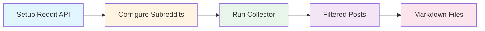
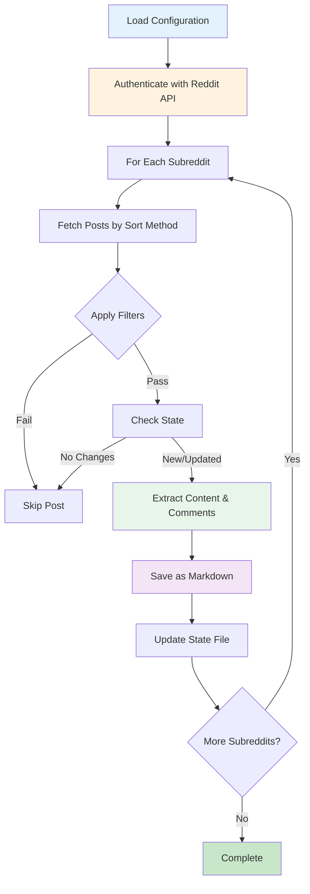

# Reddit Collector

**Automated Reddit content collection from configured subreddits with smart filtering, comment extraction, and state management.**

The Reddit collector monitors specified subreddits and automatically saves matching posts (and optionally their comments) as organized markdown files. It tracks what it has already collected to avoid duplicates and can detect when posts receive new comments for re-collection.

---

## Usage Commands

Once set up, use these commands to collect Reddit content:

```bash
# Collect from all configured subreddits
reddit-collect

# Collect from a specific subreddit
reddit-collect --subreddit "MachineLearning"

# Use a specific configuration file (e.g., design-focused subreddits)
reddit-collect --config tools/reddit/settings/reddit-design.yaml

# Dry run (test without saving files)
reddit-collect --dry-run

# Verbose output for debugging
reddit-collect --verbose

# Get help on available options
reddit-collect --help
```

**See [Setup Instructions](#quick-start) below to configure the tool.**

---

## Table of Contents

- [Quick Start](#quick-start)
- [How It Works](#how-it-works)
- [Authentication Setup](#authentication-setup)
- [Configuration](#configuration)
- [Usage](#usage)
- [Output Structure](#output-structure)
- [Security & Privacy](#security--privacy)
- [Troubleshooting](#troubleshooting)

---

## Quick Start



### Minimal Setup

1. **Set up Reddit API credentials** (see [Authentication Setup](#authentication-setup))
2. **Configure your subreddits** in `tools/reddit/settings/reddit.yaml`
3. **Add credentials to root .env file**
4. **Run collection**: `reddit-collect`

**Working Directory:** Always run commands from the project root directory.

---

## How It Works

The Reddit collector processes posts through this workflow:



### Key Concepts

- **Subreddit Configuration**: Each subreddit has custom settings (max posts, sort method, filters)
- **State Management**: Tracks processed posts to prevent duplicate processing and detect updates
- **Smart Updates**: Re-collects posts when new comments are added
- **Filters**: Content-based filtering by keywords, age, and score

---

## Authentication Setup

Reddit requires OAuth credentials to access their API. This is a one-time setup process.

### Step 1: Create a Reddit Application

1. Log in to Reddit and go to https://www.reddit.com/prefs/apps
2. Scroll to "Developed Applications" and click **"Create App"** or **"Create Another App"**
3. Fill in the form:
   - **Name**: Choose any name (e.g., "Army of Me Content Collector")
   - **App type**: Select **"script"** (important!)
   - **Description**: Optional
   - **About URL**: Optional
   - **Redirect URI**: Use `http://localhost:8080` (required but not used)
4. Click **"Create app"**

### Step 2: Get Your Credentials

After creating the app, you'll see:
- **Client ID**: A ~14 character string directly under your app name
- **Client Secret**: A ~27 character string labeled "secret"

### Step 3: Add to Root .env File

Add credentials to the root `.env` file:

```bash
# Reddit API Credentials
REDDIT_CLIENT_ID=your_client_id_here
REDDIT_CLIENT_SECRET=your_client_secret_here
```

### Step 4: Verify Authentication

Test the connection:

```bash
reddit-collect --dry-run
```

You should see configuration validation and successful API connection.

---

## Configuration

Configuration uses YAML format with environment variable substitution. The default configuration file is located at `tools/reddit/settings/reddit.yaml`.

### Basic Structure

```yaml
# Output directory for collected posts
output_dir: "output/reddit"

# State file location
state_file: "data/reddit_state.json"

# API rate limiting (seconds between requests)
rate_limit_seconds: 2.0

# Reddit API credentials (from environment)
client_id: "${REDDIT_CLIENT_ID}"
client_secret: "${REDDIT_CLIENT_SECRET}"
user_agent: "Signal:Reddit:Collector:v2.0.0"

# Default filters applied to all subreddits unless overridden
default_filters:
  max_age_days: 21              # Only posts from last 21 days
  min_score: 5                  # Minimum upvote score
  include_keywords: []          # Must contain at least one keyword
  exclude_keywords: []          # Skip if contains any keyword

# Subreddits to collect from
subreddits:
  - name: "Anthropic"
    max_posts: 50
    sort_by: "hot"
    include_comments: true
    filters:
      min_score: 10
```

### Configuration Parameters

#### Top-Level Settings

| Parameter | Type | Default | Description |
|-----------|------|---------|-------------|
| `output_dir` | string | required | Directory where markdown files are saved |
| `state_file` | string | required | Path to state tracking JSON file |
| `rate_limit_seconds` | float | 2.0 | Seconds to wait between API requests |
| `client_id` | string | required | Reddit API client ID (use env var) |
| `client_secret` | string | required | Reddit API client secret (use env var) |
| `user_agent` | string | auto | Identifies your app to Reddit API |

#### Default Filters

Applied to all subreddits unless overridden:

| Parameter | Type | Default | Description |
|-----------|------|---------|-------------|
| `max_age_days` | int | null | Only collect posts newer than this many days |
| `min_score` | int | null | Minimum upvote score required |
| `include_keywords` | list | [] | Only collect posts containing these terms |
| `exclude_keywords` | list | [] | Skip posts containing these terms |

#### Subreddit Configuration

Each subreddit can have custom settings:

| Parameter | Type | Default | Description |
|-----------|------|---------|-------------|
| `name` | string | required | Subreddit name (without "r/" prefix) |
| `max_posts` | int | 50 | Maximum posts to collect |
| `include_comments` | bool | true | Whether to extract comment threads |
| `sort_by` | string | "hot" | Sort method: hot, new, top, rising |
| `filters` | object | null | Override default filters for this subreddit |

### Example Configuration

```yaml
subreddits:
  - name: "Anthropic"
    max_posts: 20
    include_comments: true
    sort_by: "new"
    filters:
      min_score: 3
      include_keywords: ["claude", "anthropic", "assistant"]

  - name: "MachineLearning"
    max_posts: 50
    include_comments: false     # Skip comments for high-volume subreddit
    sort_by: "top"
    filters:
      max_age_days: 7           # Only last week
      min_score: 20             # Higher quality threshold
```

---

## Usage

### Basic Collection

Collect from all configured subreddits:

```bash
reddit-collect
```

### Single Subreddit Collection

Process only a specific subreddit:

```bash
reddit-collect --subreddit "MachineLearning"
```

### Validation & Testing

Test configuration without processing posts:

```bash
reddit-collect --dry-run
```

Test specific subreddit:

```bash
reddit-collect --subreddit "Anthropic" --dry-run
```

### Debug Mode

Enable verbose logging for troubleshooting:

```bash
reddit-collect --verbose
```

### Command Options

| Option | Short | Description |
|--------|-------|-------------|
| `--config PATH` | `-c` | Path to YAML configuration file (default: tools/reddit/settings/reddit.yaml) |
| `--subreddit TEXT` | `-s` | Collect from only this subreddit |
| `--dry-run` | | Validate configuration without saving files |
| `--verbose` | `-v` | Enable detailed logging output |

### Collection Output

The collector displays statistics after each run:

```
Collection completed:
  Subreddits processed: 2
  Total posts saved: 25
  Posts from 'Anthropic': 12
  Posts from 'MachineLearning': 13
  Total posts skipped: 8
```

---

## Output Structure

### Directory Organization

Posts are organized by subreddit and collection date:

```
output/reddit/
├── Anthropic/
│   └── 2024-01-15/
│       ├── 2024-01-15_r_Anthropic_Claude_3_announcement_abc123.md
│       └── 2024-01-15_r_Anthropic_New_context_window_def456.md
├── MachineLearning/
│   └── 2024-01-15/
│       ├── 2024-01-15_r_MachineLearning_Transformer_paper_ghi789.md
│       └── 2024-01-15_r_MachineLearning_Neural_scaling_laws_jkl012.md
```

### Markdown File Format

Each post is saved as a markdown file with structured frontmatter:

```markdown
---
title: "New Breakthrough in AI Research"
author: "reddit_user123"
score: 142
created_date: 2024-01-15 10:30:00+00:00
subreddit: "MachineLearning"
url: "https://reddit.com/r/MachineLearning/comments/abc123/"
post_id: "abc123"
comment_count: 28
upvote_ratio: 0.95
flair: "Research"
collected_date: 2024-01-15 15:45:00+00:00
---

# New Breakthrough in AI Research

Post content appears here...

## Comments

### Comment by u/expert_reviewer (2024-01-15 12:00 UTC)

Score: 45

Great analysis! I've been following this research...

---

### Comment by u/another_user (2024-01-15 13:30 UTC)

Score: 23

Has anyone tried replicating these results?

---
```

### Filename Convention

Files are named using the pattern:
```
{date}_{subreddit}_{title}_{post_id}.md
```

- **date**: Post collection date (YYYY-MM-DD)
- **subreddit**: Subreddit name with "r_" prefix
- **title**: Sanitized title (alphanumeric, limited to 50 chars)
- **post_id**: Reddit post ID for uniqueness

### State Tracking

The collector maintains a state file to track processed posts:

**Location**: `data/reddit_state.json`

Tracks:
- Which posts have been collected
- Comment counts (for detecting updates)
- Last update timestamps
- File paths

This prevents duplicate downloads and enables smart updates when posts receive new comments.

---

## Security & Privacy

### OAuth Security

- **Minimal Scopes**: Read-only access to public subreddits
- **Credential Isolation**: Environment variable-based credential management
- **No Password Storage**: OAuth tokens eliminate password exposure

### Input Validation

All configuration and CLI inputs are validated to prevent:
- **Subreddit name injection**: Format and length validation
- **Path traversal**: Secure file path handling
- **Content sanitization**: Safe markdown generation

### Privacy Controls

The collector includes built-in privacy protections:
- **Content Sanitization**: All post and comment content is sanitized before storage
- **Secure State Management**: Atomic file operations prevent corruption
- **No Credential Logging**: Sensitive data never appears in logs

### Rate Limiting

Reddit API quotas are managed through:
- Configurable delays between requests (`rate_limit_seconds`)
- PRAW's built-in rate limiting
- Automatic retry with exponential backoff

**API Quotas:**
- Script apps: ~60 requests per minute
- Each post fetch: ~1-2 requests (more with comments)

---

## Troubleshooting

### Authentication Issues

**"Invalid Reddit credentials" errors:**
```bash
# Verify environment variables
cat .env | grep REDDIT

# Ensure app type is set to "script" in Reddit settings
# Re-create app if credentials seem invalid
```

**"OAuth connection failed":**
- Check that `REDDIT_CLIENT_ID` and `REDDIT_CLIENT_SECRET` are in root `.env` file
- Verify credentials are correct (no extra spaces or quotes)
- Ensure app type is "script" (not "web app")

### Collection Issues

**"No posts found" with valid subreddit:**
1. Check if subreddit name is spelled correctly (no "r/" prefix)
2. Verify subreddit is public (private subreddits require special access)
3. Check filters are not too restrictive
4. Use `--verbose` for detailed filtering decisions:
   ```bash
   reddit-collect --subreddit "test" --verbose
   ```

**Posts skipped unexpectedly:**
- Check filter criteria (`max_age_days`, `min_score`, keywords)
- Verify state file hasn't already marked them as processed
- Use `--dry-run --verbose` to see filtering logic

**Rate limiting errors:**
1. Increase delay between requests:
   ```yaml
   rate_limit_seconds: 3.0  # or higher
   ```
2. Reduce `max_posts` for each subreddit
3. Wait 1-2 minutes before retrying

### Configuration Validation

**Invalid subreddit name:**
- Subreddit names must be 1-21 characters
- Only alphanumeric and underscores allowed
- Cannot start/end with underscore
- No "r/" prefix (use `MachineLearning`, not `r/MachineLearning`)

**Path errors:**
- All paths in config should be root-relative (no `./` prefix)
- Output directory: `output/reddit` (not `./output/reddit`)
- State file: `data/reddit_state.json` (not `./data/reddit_state.json`)

### Debug Commands

**Test authentication only:**
```bash
reddit-collect --dry-run --verbose
```

**Test specific subreddit without processing:**
```bash
reddit-collect --subreddit "test" --dry-run --verbose
```

**Check state file:**
```bash
cat data/reddit_state.json | python -m json.tool
```

### Common Errors Reference

| Error | Cause | Solution |
|-------|-------|----------|
| `Invalid Reddit credentials` | Missing or incorrect credentials | Check `.env` file has correct CLIENT_ID and SECRET |
| `Subreddit not found` | Invalid subreddit name or private | Verify name spelling, check if subreddit is public |
| `Configuration validation error` | Invalid YAML syntax | Check YAML formatting and indentation |
| `Rate limit exceeded` | Too many requests | Increase `rate_limit_seconds` or reduce `max_posts` |
| `State file error` | Corrupted state file | Delete `data/reddit_state.json` and re-run |

### Performance Optimization

For large collections:
1. Use specific filters to narrow what's collected
2. Limit `max_posts` per subreddit
3. Increase `rate_limit_seconds` to avoid quota issues
4. Process subreddits one at a time using `--subreddit` option
5. Set `include_comments: false` for high-volume subreddits

---

## Additional Resources

- **Reddit API Documentation**: https://www.reddit.com/dev/api
- **PRAW Library Docs**: https://praw.readthedocs.io/
- **Reddit App Setup**: https://www.reddit.com/prefs/apps
- **Reddit API Rules**: https://www.reddit.com/wiki/api

**Project Location**: `/Users/williamtrekell/Documents/army-of-me/tools/reddit/`

**Configuration File**: `/Users/williamtrekell/Documents/army-of-me/tools/reddit/settings/reddit.yaml`
