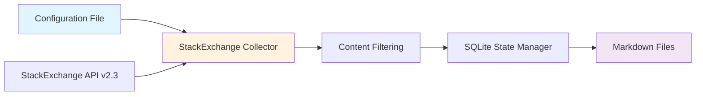
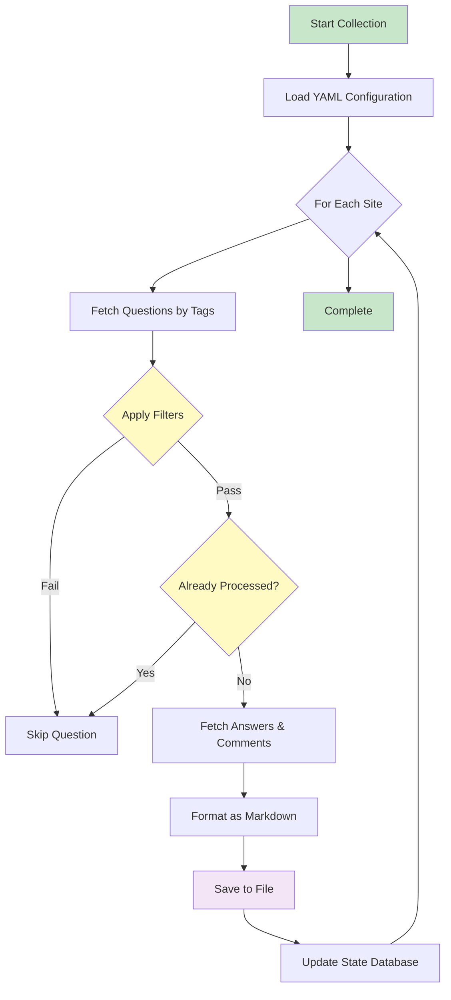

# StackExchange Collector

## Usage Commands

Once set up, use these commands to collect StackExchange content:

```bash
# Collect from all configured sites
stackexchange-collect

# Collect from specific site
stackexchange-collect --site stackoverflow

# Use specific configuration file (e.g., design-focused sites)
stackexchange-collect --config tools/stackexchange/settings/stackexchange-design.yaml

# Dry run (test without saving files)
stackexchange-collect --dry-run

# Verbose output for debugging
stackexchange-collect --verbose

# Get help on available options
stackexchange-collect --help
```

**Collect technical Q&A content from StackExchange network sites** - Stack Overflow, Server Fault, Data Science, and 170+ other communities.

Part of the Army of Me project, this collector retrieves questions, answers, and comments from StackExchange sites using the official API, with intelligent filtering and secure state management.



## Table of Contents

- [Quick Start](#quick-start)
- [How It Works](#how-it-works)
- [Configuration Guide](#configuration-guide)
- [Command Reference](#command-reference)
- [Output Structure](#output-structure)
- [API Authentication](#api-authentication)
- [Security Features](#security-features)
- [Troubleshooting](#troubleshooting)

## Quick Start

### Prerequisites
- Python 3.12+ installed
- Army of Me project installed (see main README)
- Optional: StackExchange API key for higher quotas

### Basic Collection

```bash
# From project root directory
cd /Users/williamtrekell/Documents/army-of-me

# Test your configuration (dry run - doesn't save anything)
stackexchange-collect --dry-run

# Collect from all configured sites
stackexchange-collect

# Collect from a specific site only
stackexchange-collect --site stackoverflow
```

### What You'll Get

The collector saves questions and answers as organized markdown files:

```
output/stackexchange/
├── stackoverflow/
│   ├── 2024-01-15_stackoverflow_python-async-best-practices_12345.md
│   ├── 2024-01-14_stackoverflow_machine-learning-deployment_12346.md
│   └── ...
├── datascience/
│   ├── 2024-01-15_datascience_neural-network-optimization_67890.md
│   └── ...
└── stackexchange_state.db  # Tracks processed questions
```

## How It Works



### Collection Process

1. **Configuration Loading**: Reads your YAML settings file with site selections and filters
2. **Site Iteration**: Processes each configured StackExchange site sequentially
3. **Question Retrieval**: Fetches questions matching your specified tags and sort order
4. **Content Filtering**: Applies score thresholds, age limits, and keyword filters
5. **Deduplication Check**: Verifies question hasn't been collected previously using SQLite state
6. **Detail Retrieval**: Fetches answers and comments for qualifying questions
7. **Content Formatting**: Generates markdown with metadata frontmatter
8. **File Output**: Saves to organized directory structure with sanitized filenames
9. **State Update**: Records processed question IDs to prevent duplicates

### Deduplication Strategy

The collector uses **SQLite database** for efficient state management:
- Tracks processed question IDs across all sites
- Prevents re-downloading unchanged content
- Supports incremental collection runs
- Thread-safe with atomic operations

## Configuration Guide

### Configuration File Location

Default configuration: `tools/stackexchange/settings/stackexchange.yaml`

### Basic Configuration Structure

```yaml
# Output location
output_dir: "output/stackexchange"

# API settings
api_key: "${STACKEXCHANGE_API_KEY}"  # Optional - for higher quotas
rate_limit_seconds: 1.0               # Requests per second

# Default filters (apply to all sites unless overridden)
default_filters:
  max_age_days: 30        # Only questions from last 30 days
  min_score: 5            # Minimum question score
  min_answers: 1          # Must have at least 1 answer
  include_keywords: []    # Keywords required in title/body
  exclude_keywords: []    # Keywords to exclude
  required_tags: []       # Tags that must be present
  excluded_tags: ["homework"]

# Sites to collect from
sites:
  - name: "stackoverflow"
    tags: ["python", "machine-learning"]
    max_questions: 50
    include_answers: true
    include_comments: true
    sort_order: "activity"
```

### Site Configuration Options

Each site entry supports the following options:

| Option | Type | Default | Description |
|--------|------|---------|-------------|
| `name` | string | **required** | StackExchange site name (e.g., "stackoverflow", "serverfault") |
| `tags` | list | `[]` | Filter questions by these tags |
| `max_questions` | integer | `50` | Maximum questions to retrieve per run |
| `include_answers` | boolean | `true` | Fetch and include answer content |
| `include_comments` | boolean | `true` | Fetch and include comments |
| `sort_order` | string | `"activity"` | Sort order: "activity", "votes", "creation", "relevance" |
| `filters` | object | uses `default_filters` | Site-specific filter overrides |

### Filter Criteria Options

| Filter | Type | Description |
|--------|------|-------------|
| `max_age_days` | integer | Only collect questions created within this many days |
| `min_score` | integer | Minimum question score (upvotes - downvotes) |
| `min_answers` | integer | Minimum number of answers required |
| `include_keywords` | list | Keywords that must appear in title or body |
| `exclude_keywords` | list | Keywords that disqualify the question |
| `required_tags` | list | At least one of these tags must be present |
| `excluded_tags` | list | Question cannot have any of these tags |

### Example: Multi-Site Configuration

```yaml
sites:
  # High-volume site with strict filtering
  - name: "stackoverflow"
    tags: ["python", "asyncio", "performance"]
    max_questions: 100
    sort_order: "votes"
    filters:
      min_score: 10        # Higher bar for Stack Overflow
      min_answers: 2
      max_age_days: 14

  # Specialized site with relaxed filtering
  - name: "datascience"
    tags: ["machine-learning", "neural-networks"]
    max_questions: 30
    sort_order: "activity"
    filters:
      min_score: 3         # Lower bar for smaller community
      min_answers: 1

  # Comments-only collection
  - name: "ai"
    tags: ["deep-learning", "transformers"]
    max_questions: 25
    include_answers: true
    include_comments: false  # Skip comments for this site
```

### Available StackExchange Sites

Popular sites you can collect from:
- `stackoverflow` - Programming questions
- `serverfault` - System administration
- `superuser` - Computer enthusiast questions
- `askubuntu` - Ubuntu-specific questions
- `datascience` - Data science and analytics
- `ai` - Artificial Intelligence
- `stats` - Statistical analysis
- `mathoverflow` - Mathematics research
- `physics` - Physics questions

**Full list**: See [StackExchange sites directory](https://stackexchange.com/sites)

## Command Reference

### Main Command

```bash
stackexchange-collect [OPTIONS]
```

### Command Options

| Option | Short | Type | Required | Description |
|--------|-------|------|----------|-------------|
| `--config` | `-c` | path | No | Path to YAML configuration file (default: tools/stackexchange/settings/stackexchange.yaml) |
| `--site` | `-s` | text | No | Collect from specific site only (overrides config) |
| `--dry-run` | - | flag | No | Validate configuration without saving files |
| `--verbose` | `-v` | flag | No | Enable detailed logging output |

### Usage Examples

**Test configuration validity:**
```bash
stackexchange-collect --dry-run
```

**Collect from all configured sites:**
```bash
stackexchange-collect
```

**Collect from one specific site:**
```bash
stackexchange-collect --site stackoverflow
```

**Verbose output for debugging:**
```bash
stackexchange-collect --verbose
```

**Use custom configuration:**
```bash
stackexchange-collect --config tools/stackexchange/settings/stackexchange-design.yaml
```

### Understanding Command Output

The command displays collection statistics:

```
Collection completed for stackoverflow:
  Questions processed: 50      # Total questions examined
  Questions saved: 15          # New questions saved
  Questions updated: 0         # Existing questions updated (currently unused)
  Questions skipped: 35        # Filtered out or already collected
  Errors: 0                    # API or processing errors
```

## Output Structure

### File Organization

```
output/stackexchange/
├── stackoverflow/
│   ├── 2024-01-15_stackoverflow_how-to-async-python_12345.md
│   ├── 2024-01-15_stackoverflow_best-ml-libraries_12346.md
│   └── ...
├── datascience/
│   └── ...
└── stackexchange_state.db
```

**Filename format:** `YYYY-MM-DD_sitename_question-title_questionid.md`

### Markdown File Structure

Each saved question includes:

```markdown
---
title: "How to optimize async Python code?"
author: "john_doe"
source: "stackexchange"
site: "stackoverflow"
question_id: 12345
url: "https://stackoverflow.com/questions/12345"
tags: ["python", "asyncio", "performance"]
score: 42
answer_count: 3
view_count: 1523
created_date: "2024-01-15T10:30:00Z"
collected_date: "2024-01-15T14:22:00Z"
---

# How to optimize async Python code?

[Question body with code examples...]

## Question Details

- **Score**: 42
- **Views**: 1523
- **Answers**: 3
- **Tags**: `python`, `asyncio`, `performance`

## Comments

**alice_smith** (score: 5): Have you tried using asyncio.gather()?

## Answers

### Answer 1 ✓

**Author**: experienced_dev | **Score**: 38

[Accepted answer content...]

### Answer 2

**Author**: another_user | **Score**: 12

[Additional answer content...]
```

### Frontmatter Metadata

| Field | Description |
|-------|-------------|
| `title` | Question title |
| `author` | Question author's display name |
| `source` | Always "stackexchange" |
| `site` | Specific StackExchange site |
| `question_id` | Unique question identifier |
| `url` | Link to original question |
| `tags` | List of question tags |
| `score` | Net score (upvotes - downvotes) |
| `answer_count` | Number of answers |
| `view_count` | Number of views |
| `created_date` | When question was created (ISO 8601) |
| `collected_date` | When question was collected (ISO 8601) |

### Content Sections

1. **Question Title & Body**: Original question with code blocks preserved
2. **Question Details**: Metadata summary (score, views, answers, tags)
3. **Comments**: Comments on the question (if `include_comments: true`)
4. **Answers**: All answers sorted by votes, with accepted answer marked ✓

## API Authentication

### Unauthenticated Access (Default)

**No setup required** - works immediately with default quotas:
- **300 requests per day** from single IP
- Suitable for small-scale collection
- No API key needed

### Authenticated Access (Higher Quotas)

For larger collections, register for API key:

1. **Register application**: Visit [StackApps](https://stackapps.com/apps/oauth/register)
2. **Get API key**: Create app and copy the key
3. **Set environment variable**:
   ```bash
   export STACKEXCHANGE_API_KEY="your_key_here"
   ```
4. **Update configuration**: Config file uses `${STACKEXCHANGE_API_KEY}` automatically

**Authenticated quota**: **10,000 requests per day** per key

### Monitoring Quota Usage

The collector logs quota warnings:
```
WARNING: API quota low: 9 requests remaining
```

Check headers in verbose mode:
```bash
stackexchange-collect --verbose
```

## Security Features

The StackExchange collector implements enterprise-grade security:

### Input Validation & Sanitization
- **Site name validation**: Ensures site names match StackExchange format (alphanumeric, dots, hyphens only)
- **Tag sanitization**: All tags validated and length-limited
- **Parameter bounds checking**: Numeric values validated against safe ranges
- **Content sanitization**: All API responses sanitized before storage

### API Security (SSRF Protection)
- **URL validation**: All API endpoints validated to prevent internal network access
- **Endpoint whitelisting**: Only official StackExchange API URLs permitted
- **Request parameter sanitization**: All parameters cleaned before transmission
- **Response validation**: API responses checked for unexpected content

### State Management Security
- **SQL injection prevention**: All database queries use parameterized statements
- **Atomic operations**: Transaction-based writes prevent race conditions
- **Database access controls**: Secure file permissions on state database
- **Input validation**: All state data validated before database operations

### File System Security
- **Path traversal prevention**: Filenames sanitized to prevent directory escape
- **Safe filename generation**: Special characters removed, length limits enforced
- **Directory validation**: Output paths validated before file writes
- **Atomic file operations**: Prevents partial writes and corruption

### Rate Limiting & Resource Protection
- **Configurable rate limits**: Prevents API quota exhaustion
- **Backoff handling**: Respects API rate limit headers
- **Request timeout**: Prevents hung connections
- **Memory management**: Efficient processing of large result sets

## Troubleshooting

### Common Issues

**Problem: "Configuration file not found"**
```
Error: Configuration file not found: tools/stackexchange/settings/stackexchange.yaml
```
**Solution**: Ensure you're running from the project root directory:
```bash
cd /Users/williamtrekell/Documents/army-of-me
stackexchange-collect
```

---

**Problem: "Site 'xyz' not found in configuration"**
```
Error: StackExchange site 'xyz' not found in configuration
```
**Solution**: Check site name spelling in your config matches exactly:
- Use lowercase site names
- Check available sites at https://stackexchange.com/sites
- Example: `stackoverflow` not `StackOverflow`

---

**Problem: "API quota low: X requests remaining"**
```
WARNING: API quota low: 5 requests remaining
```
**Solution**:
1. Wait for daily quota reset (UTC midnight)
2. Register for API key to increase quota to 10,000/day
3. Reduce `max_questions` in configuration
4. Increase `rate_limit_seconds` to slow collection

---

**Problem: No questions collected**
```
Questions processed: 50
Questions saved: 0
Questions skipped: 50
```
**Solution**: Your filters may be too strict:
1. Check `min_score` - try lowering it
2. Check `max_age_days` - try increasing it
3. Check `required_tags` - ensure tags exist on questions
4. Run with `--verbose` to see why questions are filtered

---

**Problem: "Invalid site name format"**
```
Error: Invalid site name format: 'my-site.com'
```
**Solution**: Use the site identifier, not the domain:
- Correct: `name: "stackoverflow"`
- Incorrect: `name: "stackoverflow.com"`

### Debug Mode

Enable verbose logging to diagnose issues:

```bash
stackexchange-collect --verbose
```

This shows:
- Configuration values loaded
- API requests and responses
- Filter decisions for each question
- State database operations
- File write operations

### Validation Testing

Test your configuration without saving files:

```bash
stackexchange-collect --dry-run
```

Validates:
- Configuration file syntax
- Site names and parameters
- API connection
- Output directory access

### Log Files

Logs are written to console. To save for analysis:

```bash
stackexchange-collect --verbose 2>&1 | tee collection.log
```

### Getting Help

1. **Check configuration**: Run `--dry-run` first
2. **Enable verbose mode**: Use `--verbose` flag
3. **Review API quota**: Check remaining requests
4. **Verify site names**: Match StackExchange site identifiers
5. **Test filters**: Start with permissive settings, then tighten

### Related Documentation

- [Tools README](../README.md) - Overview of all integrated tools
- [Integration Guide](../INTEGRATION_GUIDE.md) - How tools are integrated into Army of Me
- [Example Configuration](settings/stackexchange.yaml) - Full working example
