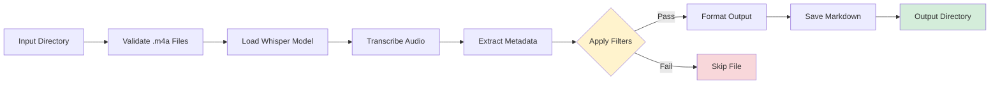

# Transcribe Tool

**Batch audio-to-text conversion with intelligent content filtering**

Transcribe converts audio recordings (.m4a files) into readable markdown documents using OpenAI's Whisper model. The tool processes entire directories at once, organizing speech into natural paragraphs and optionally filtering content by age, keywords, or patterns.

---

## Quick Start

### Prerequisites
- Python 3.12+
- Audio files in .m4a format

### Basic Usage

1. **Place audio files** in `/input/transcribe/` directory
2. **Run the tool** from project root:
   ```bash
   uv run python tools/transcribe/transcribe.py
   ```
3. **Find transcriptions** in `/output/transcriptions/` as markdown files

The tool uses configuration from `/settings/transcribe.yaml` by default.

---

## What It Does

Transcribe performs four main operations:

1. **Batch Processing** - Converts all .m4a files in the input directory automatically
2. **Speech Recognition** - Uses faster-whisper (local implementation of OpenAI's Whisper) for high-quality transcription
3. **Content Organization** - Combines speech segments into readable paragraphs based on natural pauses
4. **Selective Filtering** - Optionally keeps only transcriptions matching your criteria (applied AFTER transcription completes)

### Output Structure

Each transcription includes standardized YAML frontmatter followed by the text:

```markdown
---
title: meeting-notes.m4a
source: transcribe
created_date: 2025-11-01T09:30:00
collected_date: 2025-11-01T10:15:00
duration: '[00:45:30]'
model: medium
language: en
---

First paragraph of transcribed speech appears here, combining multiple
segments based on natural pauses in the audio...

Second paragraph continues after a significant pause in the recording...
```

---

## Configuration

Edit `/settings/transcribe.yaml` to customize behavior:

### Model Selection

```yaml
model: medium  # Options: tiny, base, small, medium, large
language: en   # Language code (auto-detected if not specified)
temperature: 0 # Lower = more deterministic output
```

**Model Guidance:**
- `tiny` - Fastest, least accurate (good for testing)
- `base` - Good balance for clear speech
- `small` - Better accuracy, reasonable speed
- `medium` - **Recommended** - Best balance of accuracy and speed
- `large` - Highest accuracy, slowest (2-3x slower than medium)

### Paragraph Detection

Controls how speech segments are combined into readable text:

```yaml
paragraph_detection:
  enabled: true
  pause_threshold: 2.0      # Seconds of silence to trigger new paragraph
  min_paragraph_chars: 100  # Minimum text length before allowing break
```

**Tuning Guidelines:**
- **More paragraphs** (shorter blocks): Set `pause_threshold: 1.5`
- **Fewer paragraphs** (longer blocks): Set `pause_threshold: 3.0`
- **Shorter paragraphs**: Set `min_paragraph_chars: 50`
- **Longer paragraphs**: Set `min_paragraph_chars: 200`

### Timestamps (Optional)

Show timestamp markers for each speech segment:

```yaml
include_timestamps: true
```

When enabled, output looks like:
```markdown
[00:02:15] -> [00:02:28]
First segment of speech appears here.

[00:02:30] -> [00:02:45]
Second segment appears here after a pause.
```

**Note:** Timestamp mode disables paragraph detection.

---

## Content Filtering

Filters determine **which audio files to keep** after transcription. The tool transcribes all audio first, then applies filters to decide which transcriptions to save.

### Filter Configuration

```yaml
filters:
  max_age_days: null         # Only process files modified within N days
  include_keywords: []       # Keep only if transcription contains these terms
  exclude_keywords: []       # Skip if transcription contains these terms
```

### Age Filtering

Process only recent audio files:

```yaml
filters:
  max_age_days: 7  # Only files modified in last 7 days
```

### Keyword Filtering

Include/exclude based on content with wildcard support (`*` = any characters, `?` = single character):

**Example 1: Keep meeting recordings**
```yaml
filters:
  include_keywords:
    - "meeting"
    - "interview*"    # Matches: interview, interviews, interviewing
    - "standup"
```

**Example 2: Skip test recordings**
```yaml
filters:
  exclude_keywords:
    - "test"
    - "draft*"        # Matches: draft, drafts, draft-version
    - "do not transcribe"
```

**Example 3: Combined filtering**
```yaml
filters:
  max_age_days: 14
  include_keywords:
    - "project *"     # Matches: "project alpha", "project meeting"
    - "client"
  exclude_keywords:
    - "*internal*"    # Matches: "internal only", "internal-discussion"
```

### How Filters Work

1. Tool transcribes the audio file
2. Combines title + transcription text for keyword matching
3. Checks against filter criteria:
   - If `max_age_days` set: file must be recent enough
   - If `include_keywords` set: must contain at least ONE keyword
   - If `exclude_keywords` set: must NOT contain ANY keyword
4. Saves transcription only if ALL criteria pass

**Case Sensitivity:** Keyword matching is case-insensitive by default.

---

## Use Cases

### 1. Voice Notes & Memos

**Scenario:** Convert daily voice memos to searchable text

**Configuration:**
```yaml
model: base
paragraph_detection:
  enabled: true
  pause_threshold: 1.5
filters:
  max_age_days: 7
```

### 2. Meeting Recordings

**Scenario:** Transcribe client meetings, filter out internal discussions

**Configuration:**
```yaml
model: medium
paragraph_detection:
  enabled: true
  pause_threshold: 2.0
include_timestamps: false
filters:
  include_keywords:
    - "client"
    - "meeting"
  exclude_keywords:
    - "internal"
    - "draft"
```

### 3. Interview Transcription

**Scenario:** High-accuracy transcription with timestamps for analysis

**Configuration:**
```yaml
model: large
include_timestamps: true
filters:
  include_keywords:
    - "interview"
```

### 4. Podcast Processing

**Scenario:** Long-form content with natural paragraph breaks

**Configuration:**
```yaml
model: medium
paragraph_detection:
  enabled: true
  pause_threshold: 3.0
  min_paragraph_chars: 200
```

---

## Advanced Usage

### Custom Configuration File

Use a different configuration file:

```bash
uv run python tools/transcribe/transcribe.py --config /path/to/custom-config.yaml
```

### Custom Output Directory

Specify output location in configuration:

```yaml
output_dir: "output/my-transcriptions"
```

Paths are relative to project root.

### Batch Processing Workflow

1. Drop multiple .m4a files into `/input/transcribe/`
2. Run tool once - processes all files sequentially
3. Review transcriptions in `/output/transcriptions/`
4. Filtered-out files are not saved (original audio remains untouched)

---

## Technical Details

### Architecture



### Processing Flow

1. **File Discovery** - Scans `/input/transcribe/` for .m4a files
2. **Model Loading** - Loads faster-whisper model (cached for batch processing)
3. **Transcription** - Processes audio through Whisper model
4. **Segment Analysis** - Detects pauses between speech segments
5. **Paragraph Assembly** - Combines segments based on pause threshold
6. **Metadata Extraction** - Captures file creation date, duration, language
7. **Filter Application** - Evaluates age, include/exclude keywords
8. **Output Generation** - Creates markdown with YAML frontmatter
9. **File Save** - Writes to output directory with sanitized filename

### Dependencies

- **faster-whisper** - Local Whisper implementation (faster than OpenAI's official version)
- **pydub** - Audio file metadata extraction
- **PyYAML** - Configuration and frontmatter handling
- **click** - Command-line interface

### Performance Notes

- **Model loading** occurs once per batch (not per file)
- **Processing speed** depends on:
  - Audio duration (roughly 1:1 to 1:3 real-time for medium model)
  - Model size (large is 2-3x slower than medium)
  - CPU performance (tool uses CPU, not GPU by default)

**Example:** 30-minute audio file with medium model = ~30-90 seconds processing time

---

## Troubleshooting

### No Output Files Generated

**Check filters:** If using keyword filters, verify they match your audio content:

```bash
# Temporarily disable filters to test
filters:
  max_age_days: null
  include_keywords: []
  exclude_keywords: []
```

### Transcription Quality Issues

**Try a larger model:**
```yaml
model: large  # More accurate but slower
```

**Verify language detection:** Check log output for detected language probability. If low (<0.8), specify language explicitly:
```yaml
language: en  # or 'es', 'fr', etc.
```

### Poor Paragraph Breaks

**Adjust pause threshold:**
```yaml
paragraph_detection:
  pause_threshold: 1.5  # More sensitive to pauses
  min_paragraph_chars: 50  # Allow shorter paragraphs
```

### Files Appear Too Old (Age Filter Issue)

The tool uses file modification date (`st_mtime`), not creation date. If files were copied/moved recently, their modification date may differ from when they were originally recorded.

---

## Integration with Other Tools

Transcribe uses the **standardized toolbox architecture**:

- **Shared Filters** - Uses `/tools/_shared/filters.py` for consistent filtering across all tools
- **Shared Security** - Uses `/tools/_shared/security.py` for filename sanitization
- **Standard Frontmatter** - Output format compatible with PDF-to-MD, Gmail, Reddit collectors
- **Unified Settings** - Configuration follows same pattern as other `/settings/*.yaml` files

**Cross-Tool Workflow Example:**

1. Transcribe audio notes about a project
2. Collect related emails with Gmail tool (using same keywords)
3. Collect relevant Reddit discussions (same keywords)
4. All outputs have consistent frontmatter for downstream processing

---

## File Locations

| Path | Purpose |
|------|---------|
| `/input/transcribe/` | Place .m4a audio files here |
| `/output/transcriptions/` | Generated markdown files |
| `/settings/transcribe.yaml` | Tool configuration |
| `/tools/transcribe/transcribe.py` | Main script |
| `/tools/_shared/filters.py` | Shared filtering logic |

**Absolute Paths:**
- Input: `/Users/williamtrekell/Documents/durandal/input/transcribe/`
- Output: `/Users/williamtrekell/Documents/durandal/output/transcriptions/`
- Config: `/Users/williamtrekell/Documents/durandal/settings/transcribe.yaml`

---

## See Also

- **PDF-to-MD Tool** - Converts PDF documents with similar frontmatter structure
- **Content Collectors** - Gmail, Reddit, StackExchange tools use same filtering system
- **Shared Filters Documentation** - `/tools/_shared/README.md` (if exists)

---

**Version:** Post-standardization (2025)
**Maintained by:** Durandal toolbox project
**License:** Project license applies
